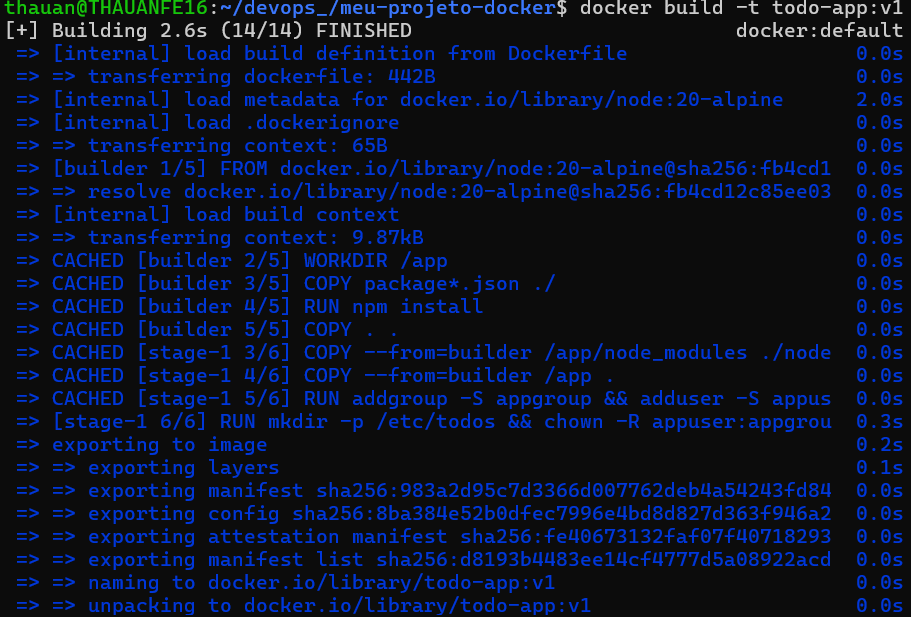
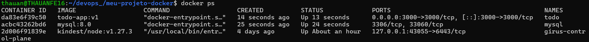
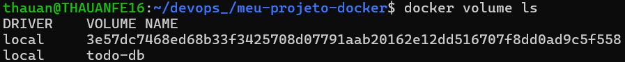
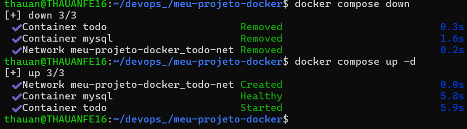
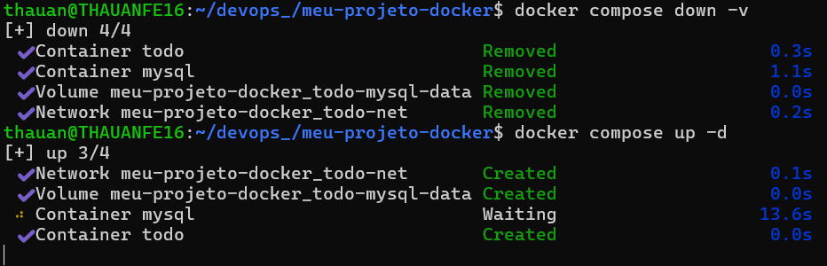
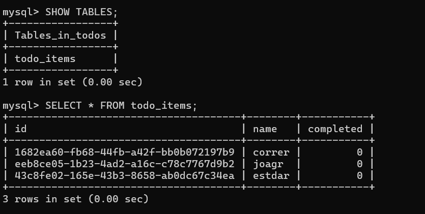
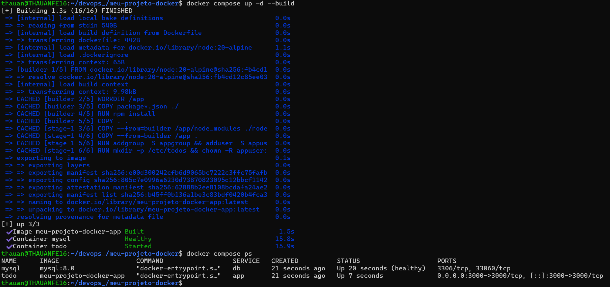
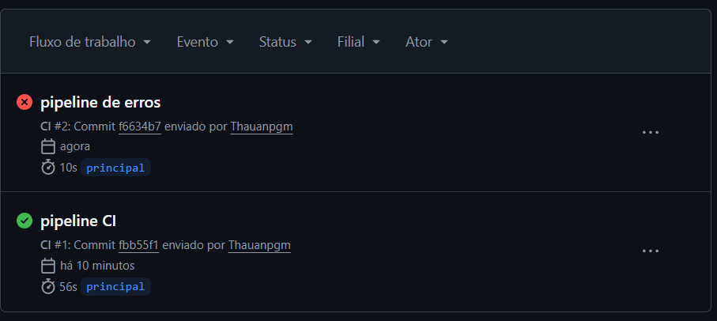
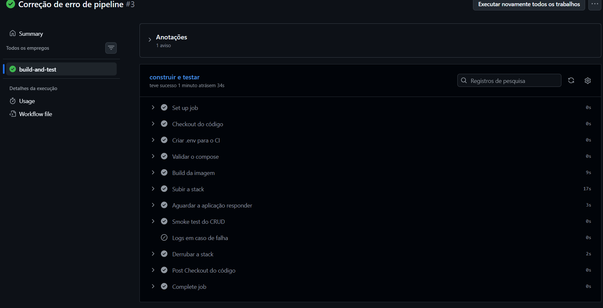
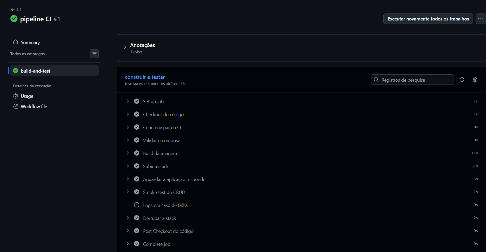

# Projeto Integrador – Docker e DevOps

**Aluno:** Thauan dos Santos Machado

## Descrição

Este projeto foi desenvolvido como atividade prática da disciplina de Docker e DevOps. O objetivo foi containerizar uma aplicação Node.js, configurar persistência de dados utilizando volumes, estabelecer a comunicação entre containers por meio de redes Docker, orquestrar os serviços com Docker Compose e automatizar o processo utilizando GitHub Actions.

## Tecnologias Utilizadas

- Docker
- Docker Compose
- Node.js
- MySQL
- Git
- GitHub
- GitHub Actions

## Estrutura do Projeto

```
.
├── .github/
│   └── workflows/
│       └── ci.yml
├── Imagens/
├── src/
├── spec/
├── Dockerfile
├── compose.yaml
├── README.md
└── package.json
```

## Como executar

Construir e iniciar a aplicação:

```bash
docker compose up -d --build
```

Parar a aplicação:

```bash
docker compose down
```

---

# 1. Dockerfile, imagem criada e container executando

Foi criado um Dockerfile para containerizar a aplicação Node.js. Após a construção da imagem, os containers foram iniciados com sucesso, confirmando que a aplicação e o banco de dados estavam funcionando corretamente.





---

# 2. Volume criado

Foi criado um volume Docker para armazenar os dados do banco MySQL. Esse volume garante que as informações permaneçam disponíveis mesmo após a remoção dos containers.



---

# 3. Persistência do volume

Para validar a persistência, os containers foram removidos utilizando `docker compose down` e iniciados novamente. Os dados permaneceram armazenados, comprovando o funcionamento do volume Docker.



---

# 4. Network Inspect

Foi utilizada a inspeção da rede Docker para verificar que os containers da aplicação e do banco de dados estavam conectados corretamente à mesma rede.



---

# 5. Banco de dados

Foi realizada a verificação das tabelas criadas pela aplicação no banco de dados MySQL.



---

# 6. Docker Compose

O comando `docker compose ps` foi utilizado para verificar que todos os serviços definidos no arquivo `compose.yaml` estavam em execução.



---

# 7. GitHub Actions

Foi criado um pipeline de Integração Contínua para automatizar a validação do projeto sempre que ocorre um `push` ou `pull_request`.

## Pipeline com erro

Para validar o funcionamento do workflow, foi provocado propositalmente um erro. O GitHub Actions identificou a falha e interrompeu a execução do pipeline.



## Pipeline corrigido

Após corrigir o problema, o pipeline foi executado novamente com sucesso, validando todas as etapas da integração contínua.



## Logs da execução

Os logs do workflow demonstram todas as etapas executadas, incluindo a validação do Docker Compose, construção da imagem, inicialização da aplicação, execução do smoke test e encerramento da stack.



---

# Conclusão

Durante o desenvolvimento desta atividade foi possível aplicar os principais conceitos de Docker e DevOps, incluindo a criação de imagens, execução de containers, persistência de dados com volumes, comunicação entre serviços utilizando redes Docker, orquestração com Docker Compose e automação da integração contínua por meio do GitHub Actions.